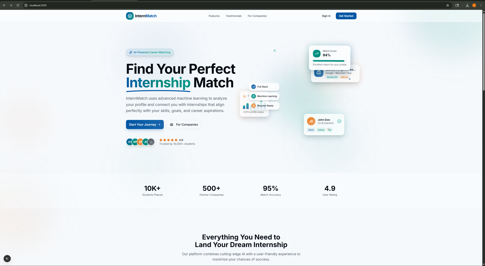
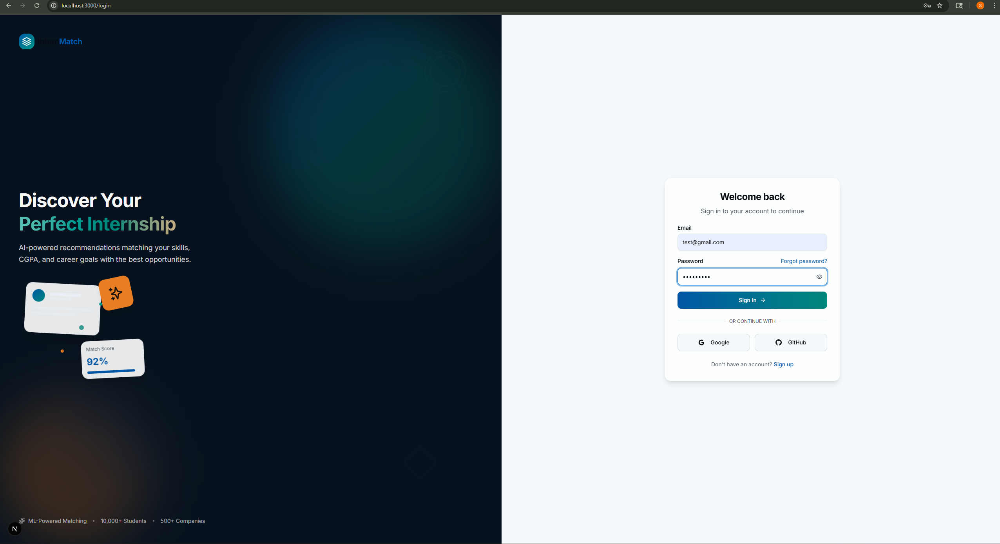

# InternMatch

InternMatch is an internship recommendation platform that helps students discover suitable internships based on their profile, skills, and preferences. It also gives companies a workspace to post internships and review applicants, while admins can monitor and manage the platform.

## Overview

The project combines:

- a modern `Next.js` frontend
- a `Node.js + Express` backend
- a separate `Flask` ML service for recommendation support
- `MongoDB` for application data

The main goal is to create a complete internship matching workflow with student, company, and admin modules in one system.

## Key Features

### Student

- Signup and login
- Profile creation with academic and skill details
- Internship recommendations with match scores
- ML role signal insights
- Resume builder with live preview
- Application tracking dashboard

### Company

- Company profile management
- Internship posting
- Applicant review and filtering
- Application status updates
- Hiring dashboard with listing overview

### Admin

- Platform dashboard
- User management
- Company management
- Internship management
- Basic platform activity monitoring

## Tech Stack

### Frontend

- `Next.js`
- `TypeScript`
- `Tailwind CSS`
- component-based UI structure

### Backend

- `Node.js`
- `Express.js`
- `MongoDB`
- `Mongoose`
- `JWT`
- `bcryptjs`

### ML Service

- `Python`
- `Flask`
- `scikit-learn`
- `pandas`
- `numpy`

## Project Structure

```text
Playground/
  client/        Next.js frontend
  server/        Express backend
  ml-service/    Flask recommendation service
  docs/          planning notes and supporting material
```

## Main Flows Implemented

- Student authentication and profile flow
- Student internship recommendations
- Student resume builder
- Student application tracking
- Company internship posting and applicant review
- Admin dashboard and management pages
- Flask-based ML recommendation support with backend fallback scoring

## Recommended GitHub Screenshots

These are the best pages to upload in your GitHub repo or project report:

1. Landing page
2. Login page
3. Signup page
4. Student profile page
5. Student predictions page
6. Student applications page
7. Resume builder page
8. Company dashboard
9. Post internship page
10. Applicants page
11. Admin dashboard
12. Admin management pages

### Screenshot tips

- Use screenshots that show filled data, not empty forms
- Make sure the prediction page shows real matches
- Avoid showing passwords or secrets
- Blur or replace personal email addresses before uploading publicly
- Use full-page browser screenshots for a cleaner look

## Screenshots Folder

Save your GitHub screenshots inside:

```text
docs/screenshots/
```

Use these file names:

- `home.png`
- `login.png`
- `signup.png`
- `student-profile.png`
- `student-predictions.png`
- `student-applications.png`
- `resume-builder.png`
- `company-dashboard.png`
- `company-applicants.png`
- `admin-dashboard.png`

Once you add those files, you can embed them in the README like this:

```md
## Screenshots

### Landing Page


### Login Page


### Student Predictions

```

## Local Setup

### 1. Clone the repository

```bash
git clone https://github.com/shoaib320/internmatch.git
cd internmatch
```

### 2. Backend setup

Create `server/.env` and add your real values:

```env
PORT=5000
MONGODB_URI=your_mongodb_connection_string
JWT_SECRET=your_secret_key
JWT_EXPIRES_IN=7d
ML_SERVICE_URL=http://127.0.0.1:8000
CORS_ORIGIN=http://localhost:3000
```

Run the backend:

```bash
cd server
npm install
npm run dev
```

### 3. Frontend setup

Optional: copy `client/.env.example` to `client/.env` if needed.

Run the frontend:

```bash
cd client
npm install
npm run dev
```

### 4. ML service setup

Install dependencies and start Flask:

```bash
cd ml-service
python -m pip install -r requirements.txt
python app.py
```

## Run Order

Start the services in this order:

1. `ml-service`
2. `server`
3. `client`

Then open:

- `http://localhost:3000`

## What To Test First

- Student signup and login
- Student profile save/update
- Internship recommendations
- Resume builder save/download flow
- Company profile save
- Internship posting
- Applicant review and status updates
- Admin dashboard and management pages

## Notes

- `server/.env` should never be committed to GitHub
- The repository already includes `.env.example` files for setup guidance
- This project is currently structured as a working full-stack prototype / demo system

## Future Improvements

- stronger role-based signup restrictions
- better input validation
- pagination and filtering on admin tables
- saved internships and detail pages
- model persistence for faster ML startup
- richer PDF export for resumes
