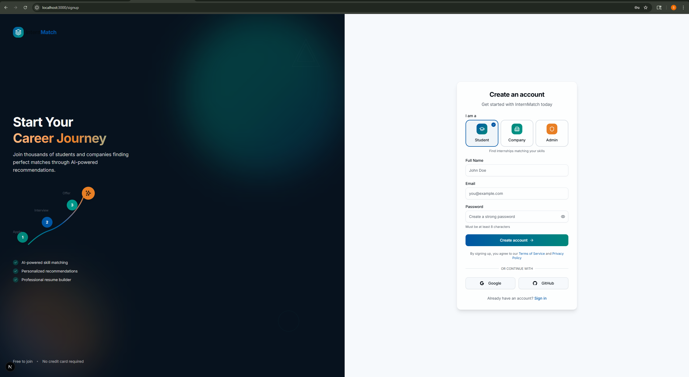
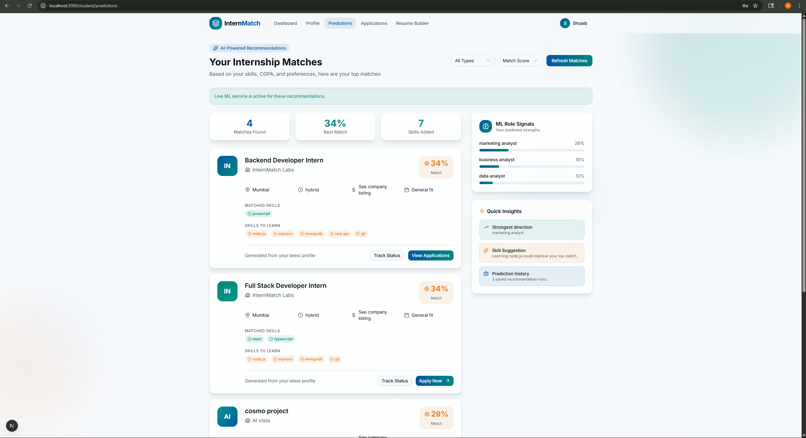
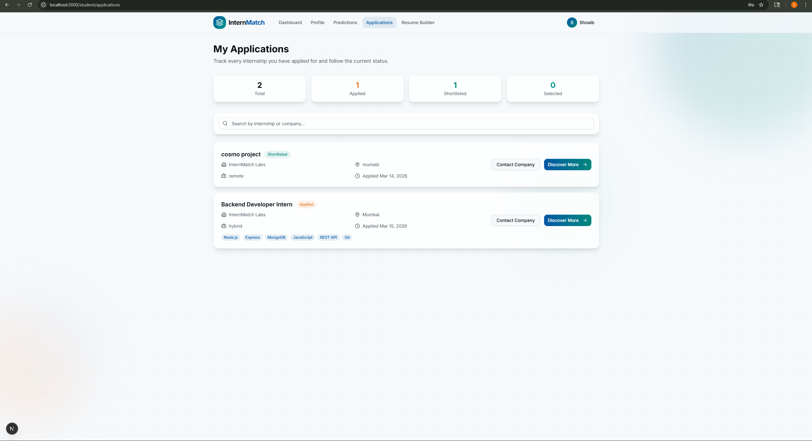
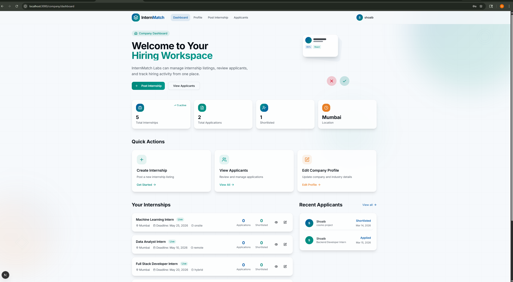

# InternMatch

InternMatch is an AI-assisted internship recommendation platform built for students, companies, and admins. It helps students discover relevant internships based on their profile, skills, and preferences, while giving companies a clean workspace to post roles and review applicants.

## Highlights

- ML-powered internship matching
- Student profile and recommendation flow
- Resume builder with live preview
- Company hiring dashboard and applicant management
- Admin dashboard for platform monitoring
- Full-stack architecture with separate ML service

## Tech Stack

### Frontend

- `Next.js`
- `TypeScript`
- `Tailwind CSS`

### Backend

- `Node.js`
- `Express.js`
- `MongoDB`
- `Mongoose`
- `JWT`
- `bcryptjs`

### ML Service

- `Python`
- `Flask`
- `scikit-learn`
- `pandas`
- `numpy`

## Project Structure

```text
Playground/
  client/        Next.js frontend
  server/        Express backend
  ml-service/    Flask recommendation service
  docs/          screenshots and project notes
```

## Core Modules

### Student

- Signup and login
- Profile creation and update
- Internship recommendations with match score
- Prediction insights and role signals
- Resume builder
- Application tracking

### Company

- Company profile management
- Internship posting
- Applicant review
- Status updates for applications
- Hiring dashboard

### Admin

- Platform dashboard
- User management
- Company management
- Internship management

## Screenshots

### Landing Page


### Login


### Signup



### Student Predictions



### Student Applications



### Company Dashboard



## How It Works

1. Students create an account and complete their profile.
2. The platform analyzes skills, education, and preferences.
3. The ML service and backend scoring logic generate internship recommendations.
4. Students track applications and improve their resume.
5. Companies post internships and review matched applicants.
6. Admins manage the full platform from a central dashboard.

## Local Setup

### 1. Clone the repository

```bash
git clone https://github.com/shoaib320/internmatch.git
cd internmatch
```

### 2. Configure the backend

Create `server/.env` with your own values:

```env
PORT=5000
MONGODB_URI=your_mongodb_connection_string
JWT_SECRET=your_secret_key
JWT_EXPIRES_IN=7d
ML_SERVICE_URL=http://127.0.0.1:8000
CORS_ORIGIN=http://localhost:3000
```

### 3. Start the services

#### Backend

```bash
cd server
npm install
npm run dev
```

#### Frontend

```bash
cd client
npm install
npm run dev
```

#### ML Service

```bash
cd ml-service
python -m pip install -r requirements.txt
python app.py
```

## Run Order

Start the app in this order:

1. `ml-service`
2. `server`
3. `client`

Then open the frontend URL shown in the client terminal, usually:

- `http://localhost:3000`

## What To Test

- Student signup and login
- Student profile save and update
- Internship recommendation generation
- Resume builder flow
- Company profile and internship posting
- Applicant review and status updates
- Admin dashboard and management pages

## Notes

- `server/.env` should never be committed to GitHub
- This repository includes screenshot assets inside `docs/screenshots`
- This project is currently a working prototype / academic-style full-stack system

## Future Improvements

- stronger role-based signup restrictions
- better validation on backend inputs
- pagination and filters for admin tables
- saved internships and internship detail pages
- persisted ML model artifacts
- richer PDF export for resumes
